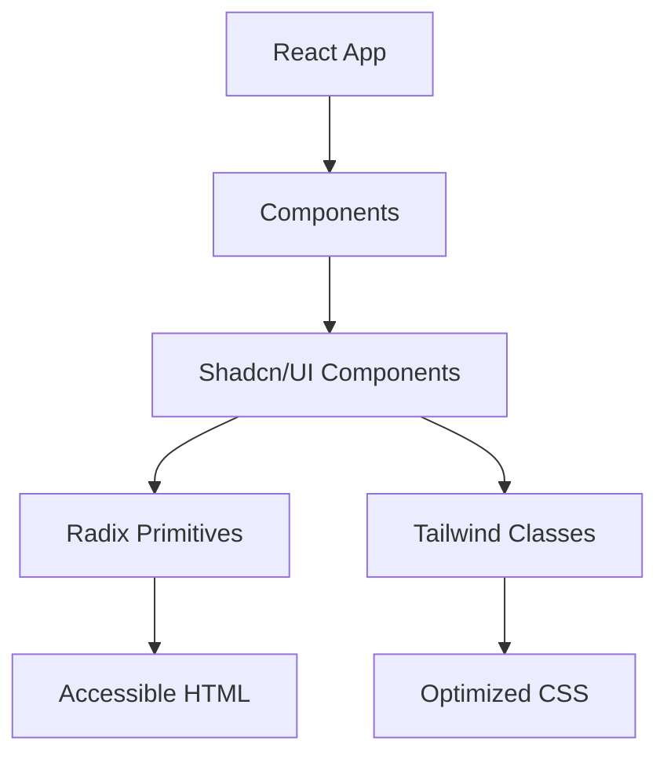

# Chapitre 1 : Introduction à la conception d'interfaces modernes

## Qu'est-ce qu'une interface moderne ?

Une interface moderne ne se résume pas simplement à un design "à la mode". Elle répond à des critères précis qui reflètent les attentes des utilisateurs d'aujourd'hui et les meilleures pratiques de l'industrie.

### Les caractéristiques d'une interface moderne

#### 1. **Réactivité et Performance**

Les utilisateurs s'attendent à des interfaces instantanées. Une interface moderne doit :
- Se charger rapidement (< 3 secondes)
- Répondre immédiatement aux interactions
- Offrir des transitions fluides
- Fonctionner sur tous les appareils

```tsx
// Exemple : Chargement optimisé avec lazy loading
import { lazy, Suspense } from 'react';

const Dashboard = lazy(() => import('./Dashboard'));

function App() {
  return (
    <Suspense fallback={<div>Chargement...</div>}>
      <Dashboard />
    </Suspense>
  );
}
```

#### 2. **Accessibilité par conception**

Une interface moderne est accessible à tous, quelles que soient leurs capacités :
- Navigation au clavier
- Compatibilité avec les lecteurs d'écran
- Contrastes suffisants
- Textes alternatifs pour les images

💡 **Astuce** : L'accessibilité n'est pas une fonctionnalité optionnelle, c'est une nécessité légale et éthique.

#### 3. **Design cohérent et intentionnel**

Chaque élément a une raison d'être :
- Hiérarchie visuelle claire
- Espacement cohérent
- Palette de couleurs réfléchie
- Typographie lisible

#### 4. **Adaptabilité (Responsive Design)**

L'interface s'adapte à tous les écrans :
- Mobile first
- Tablettes
- Desktop
- Large screens

```css
/* Approche mobile-first avec Tailwind */
/* Par défaut : mobile */
/* sm: 640px et plus */
/* md: 768px et plus */
/* lg: 1024px et plus */
```

#### 5. **Interactivité intuitive**

Les utilisateurs doivent comprendre immédiatement comment utiliser l'interface :
- Feedbacks visuels clairs
- États des éléments (hover, focus, active, disabled)
- Animations significatives
- Messages d'erreur explicites

---

## Les fondations du design system

### Qu'est-ce qu'un design system ?

Un **design system** est un ensemble de standards, composants et guidelines qui définissent l'identité visuelle et l'expérience utilisateur d'un produit.

### Composants d'un design system

#### 1. **Tokens de design**

Les tokens sont les valeurs atomiques de votre design :

```tsx
// design-tokens.ts
export const colors = {
  primary: {
    50: '#eff6ff',
    100: '#dbeafe',
    500: '#3b82f6',
    900: '#1e3a8a',
  },
  neutral: {
    0: '#ffffff',
    50: '#f9fafb',
    900: '#111827',
    1000: '#000000',
  }
};

export const spacing = {
  xs: '0.25rem',   // 4px
  sm: '0.5rem',    // 8px
  md: '1rem',      // 16px
  lg: '1.5rem',    // 24px
  xl: '2rem',      // 32px
};

export const typography = {
  fontFamily: {
    sans: ['Inter', 'system-ui', 'sans-serif'],
    mono: ['Fira Code', 'monospace'],
  },
  fontSize: {
    xs: '0.75rem',
    sm: '0.875rem',
    base: '1rem',
    lg: '1.125rem',
    xl: '1.25rem',
    '2xl': '1.5rem',
  }
};
```

#### 2. **Composants primitifs**

Les briques de base réutilisables :
- Boutons
- Inputs
- Cards
- Badges
- Avatars

#### 3. **Composants composés**

Des composants plus complexes assemblés à partir de primitifs :
- Formulaires
- Modales
- Navigation
- Data tables

#### 4. **Patterns et templates**

Des solutions réutilisables pour des problèmes courants :
- Authentification
- Tableaux de bord
- Pages de paramètres
- Flux d'onboarding

### Avantages d'un design system

✅ **Cohérence** : Même apparence partout
✅ **Efficacité** : Développement plus rapide
✅ **Maintenabilité** : Un seul endroit à modifier
✅ **Collaboration** : Langage commun entre designers et développeurs
✅ **Scalabilité** : Facile à étendre

---

## Pourquoi React + Tailwind + Radix + Shadcn/UI ?

### Le problème des approches traditionnelles

#### Approche classique CSS

```css
/* styles.css - Difficile à maintenir */
.button {
  padding: 12px 24px;
  background-color: #3b82f6;
  color: white;
  border-radius: 6px;
}

.button-large {
  padding: 16px 32px;
  font-size: 18px;
}

.button-disabled {
  opacity: 0.5;
  cursor: not-allowed;
}

/* Des centaines de classes similaires... */
```

**Problèmes** :
- ❌ Noms de classes à inventer constamment
- ❌ CSS non utilisé difficile à identifier
- ❌ Spécificité et conflits
- ❌ Difficile de savoir où supprimer du code

#### Approche CSS-in-JS pure

```tsx
// Styled-components, Emotion, etc.
const Button = styled.button`
  padding: 12px 24px;
  background-color: #3b82f6;
  color: white;
  border-radius: 6px;
  
  &:hover {
    background-color: #2563eb;
  }
`;
```

**Problèmes** :
- ❌ Bundle JS plus lourd
- ❌ Runtime overhead
- ❌ Difficile à partager entre projets
- ❌ Pas de standardisation

### La solution : Notre stack moderne

Notre stack combine le meilleur de chaque outil :

```
┌─────────────────────────────────────────────┐
│              VOTRE APPLICATION              │
├─────────────────────────────────────────────┤
│  Shadcn/UI (Composants copiables)          │
│  ↓ utilise                                  │
│  Radix UI (Primitives accessibles)         │
│  ↓ stylisé avec                            │
│  Tailwind CSS (Utility-first CSS)          │
│  ↓ dans                                     │
│  React (Composants UI)                     │
└─────────────────────────────────────────────┘
```

#### React : La fondation

**Pourquoi React ?**
- ✅ Composants réutilisables
- ✅ Écosystème mature et vaste
- ✅ Performance optimisée (Virtual DOM)
- ✅ Grande communauté
- ✅ Support d'entreprise (Meta)

```tsx
// Composant React simple
function Welcome({ name }: { name: string }) {
  return <h1>Bonjour {name}</h1>;
}
```

#### Tailwind CSS : Le style utility-first

**Pourquoi Tailwind ?**
- ✅ Pas de noms de classes à inventer
- ✅ CSS optimisé automatiquement
- ✅ Responsive design facile
- ✅ Thèmes et dark mode intégrés
- ✅ Cohérence garantie

```tsx
// Avant : CSS personnalisé
<button className="my-custom-button">Click</button>

// Avec Tailwind : composition d'utilitaires
<button className="px-4 py-2 bg-blue-500 text-white rounded hover:bg-blue-600">
  Click
</button>
```

#### Radix UI : L'accessibilité sans compromis

**Pourquoi Radix ?**
- ✅ Accessibilité intégrée (ARIA)
- ✅ Primitives non stylées (liberté totale)
- ✅ Gestion du focus et du clavier
- ✅ Composants complexes simplifiés
- ✅ Testé et éprouvé

```tsx
// Dialog accessible sans effort
import * as Dialog from '@radix-ui/react-dialog';

function MyDialog() {
  return (
    <Dialog.Root>
      <Dialog.Trigger>Ouvrir</Dialog.Trigger>
      <Dialog.Portal>
        <Dialog.Overlay />
        <Dialog.Content>
          <Dialog.Title>Titre</Dialog.Title>
          <Dialog.Description>Description</Dialog.Description>
        </Dialog.Content>
      </Dialog.Portal>
    </Dialog.Root>
  );
}
```

#### Shadcn/UI : Les composants prêts à l'emploi

**Pourquoi Shadcn/UI ?**
- ✅ Composants copiés dans votre projet (pas de dépendance)
- ✅ Personnalisables à 100%
- ✅ Best practices intégrées
- ✅ Design moderne et professionnel
- ✅ CLI pour générer des composants

```bash
# Ajouter un composant Button
npx shadcn-ui@latest add button

# Le composant est copié dans votre projet
# Vous pouvez le modifier librement !
```

---

## Présentation de la stack technique

### Vue d'ensemble de l'écosystème



### Versions et compatibilité

Au moment de l'écriture de ce livre :

| Outil | Version | Notes |
|-------|---------|-------|
| React | 18.2+ | Hooks, Suspense, Concurrent Features |
| Tailwind CSS | 3.4+ | Arbitrary values, Container queries |
| Radix UI | 1.x | Stable, production-ready |
| Shadcn/UI | Latest | Évolution constante |

### L'écosystème complémentaire

Pour une expérience complète, nous utiliserons aussi :

#### 1. **TypeScript**
```tsx
// Type safety pour vos composants
interface ButtonProps {
  variant?: 'primary' | 'secondary';
  size?: 'sm' | 'md' | 'lg';
  children: React.ReactNode;
}

export const Button = ({ variant = 'primary', size = 'md', children }: ButtonProps) => {
  // ...
};
```

#### 2. **Lucide React** (Icônes)
```tsx
import { Search, User, Settings } from 'lucide-react';

<Button>
  <Search className="w-4 h-4 mr-2" />
  Rechercher
</Button>
```

#### 3. **Class Variance Authority (CVA)**
```tsx
// Gérer les variants de composants
import { cva } from 'class-variance-authority';

const buttonVariants = cva(
  'rounded font-medium', // base
  {
    variants: {
      variant: {
        primary: 'bg-blue-500 text-white',
        secondary: 'bg-gray-200 text-gray-900',
      },
      size: {
        sm: 'px-3 py-1 text-sm',
        md: 'px-4 py-2',
        lg: 'px-6 py-3 text-lg',
      }
    }
  }
);
```

#### 4. **clsx / cn** (Utilitaire de classes)
```tsx
import { clsx } from 'clsx';
import { twMerge } from 'tailwind-merge';

// Fusion intelligente des classes Tailwind
function cn(...inputs: ClassValue[]) {
  return twMerge(clsx(inputs));
}

// Usage
<div className={cn('p-4', isActive && 'bg-blue-500', className)} />
```

---

## Aperçu du projet fil rouge

### Ce que nous allons construire

Au fil de ce livre, nous construirons un **tableau de bord interactif moderne** qui intègre tous les concepts appris.

### Fonctionnalités du projet

#### 1. **Système de navigation**
- Sidebar responsive
- Navigation par tabs
- Breadcrumbs

#### 2. **Gestion des thèmes**
- Light / Dark mode
- Thèmes personnalisés
- Persistence des préférences

#### 3. **Composants interactifs**
- Formulaires avec validation
- Modales et dialogs
- Dropdowns et menus
- Data tables avec tri et filtres

#### 4. **Dashboard**
- Cards statistiques
- Graphiques (avec Recharts)
- Activité en temps réel
- Notifications

#### 5. **Animations**
- Transitions de page
- Micro-interactions
- Loading states
- Skeleton screens

### Aperçu du code final

```tsx
// src/App.tsx - Structure principale
import { ThemeProvider } from '@/components/theme-provider';
import { Sidebar } from '@/components/sidebar';
import { Header } from '@/components/header';
import { Dashboard } from '@/pages/dashboard';

function App() {
  return (
    <ThemeProvider defaultTheme="system" storageKey="app-theme">
      <div className="flex h-screen bg-background">
        <Sidebar />
        <div className="flex-1 flex flex-col overflow-hidden">
          <Header />
          <main className="flex-1 overflow-y-auto p-6">
            <Dashboard />
          </main>
        </div>
      </div>
    </ThemeProvider>
  );
}
```

### Architecture du projet

```
src/
├── components/
│   ├── ui/              # Composants Shadcn/UI
│   │   ├── button.tsx
│   │   ├── dialog.tsx
│   │   ├── dropdown-menu.tsx
│   │   └── ...
│   ├── sidebar.tsx      # Composants métier
│   ├── header.tsx
│   └── theme-provider.tsx
├── hooks/
│   ├── use-theme.ts
│   └── use-toast.ts
├── lib/
│   ├── utils.ts         # Fonctions utilitaires
│   └── constants.ts
├── pages/
│   ├── dashboard.tsx
│   ├── settings.tsx
│   └── ...
├── styles/
│   └── globals.css
└── App.tsx
```

---

## Résumé du chapitre

Dans ce premier chapitre, nous avons posé les fondations de notre voyage :

✅ **Interface moderne** : Performance, accessibilité, cohérence, adaptabilité
✅ **Design system** : Tokens, composants, patterns pour la cohérence
✅ **Stack technique** : React + Tailwind + Radix + Shadcn/UI
✅ **Écosystème** : TypeScript, Lucide, CVA pour compléter
✅ **Projet fil rouge** : Dashboard interactif avec toutes les fonctionnalités modernes

### Points clés à retenir

💡 Une interface moderne n'est pas seulement jolie, elle est performante et accessible

💡 Un design system garantit la cohérence et accélère le développement

💡 Notre stack combine les forces de chaque outil pour un résultat optimal

💡 Shadcn/UI n'est pas une bibliothèque de composants, c'est une collection de code que vous possédez

---

## Exercices

### Exercice 1 : Analyse d'interfaces
Visitez 3 sites web modernes (ex: Vercel, Linear, GitHub) et identifiez :
- Les patterns de design récurrents
- Les animations et interactions
- La cohérence visuelle
- L'expérience responsive

### Exercice 2 : Audit d'accessibilité
Utilisez l'extension Axe DevTools pour analyser un site que vous utilisez quotidiennement. Notez les problèmes d'accessibilité trouvés.

### Exercice 3 : Réflexion sur le design system
Listez 5 composants que vous utilisez fréquemment dans vos projets. Pour chacun, identifiez :
- Les variants nécessaires (tailles, couleurs, états)
- Les props à exposer
- Les cas d'usage

---

**Prêt à maîtriser React ?** → [Chapitre 2 : Fondamentaux de React](./chapitre-02.md)

